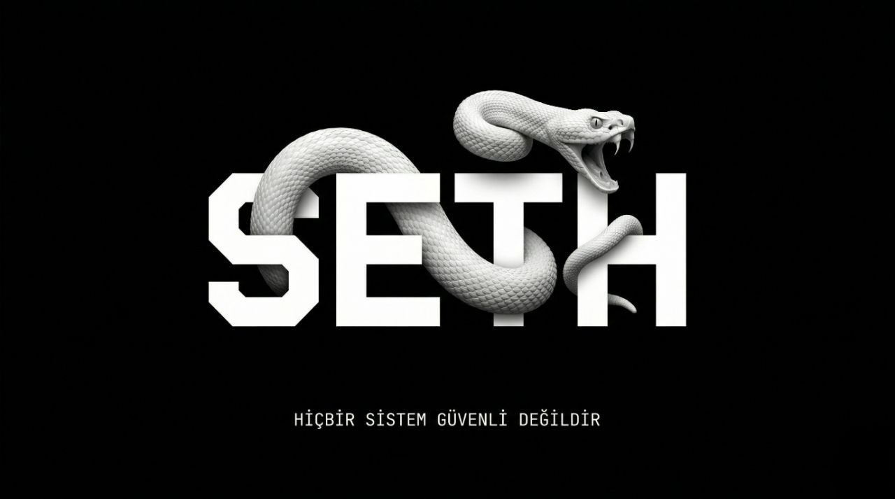

<p align="center">
  
</p>

<h1 align="center">SETH</h1>

<p align="center">
  <strong>Terminalinizde çalışan Türkçe yapay zeka kodlama ve siber güvenlik ajanı.</strong><br/>
  11 AI sağlayıcısı, 40+ araç, CTF motoru, kalıcı bellek, crash recovery ve çok daha fazlası.
</p>

<p align="center">
  
  
  
  
  
</p>

---

## 🎯 SETH Nedir?

SETH, terminalde çalışan, Türkçe arayüzlü bir yapay zeka kodlama ve siber güvenlik ajanıdır. Tek bir komutla başlar, projenizi analiz eder, kod yazar, test çalıştırır, güvenlik taraması yapar ve raporlar.

**Temel felsefe:** Siz yönlendirin, SETH uygulasın. Araştır → Planla → Uygula döngüsüyle her görevi otonom olarak tamamlar.

**Neden SETH?**
- 🇹🇷 Tamamen Türkçe arayüz ve komutlar
- 🔒 Yerel modeller (Ollama, LM Studio) ile %100 gizlilik
- 🛡️ Siber güvenlik araçları entegrasyonu (nmap, sqlmap, nikto vb.)
- 🧠 Kalıcı bellek — projelerinizi ve tercihlerinizi hatırlar, oturumlar arası öğrenir
- ⚡ 12 farklı AI sağlayıcısı — tek komutla geçiş
- 🔄 Crash recovery — beklenmedik kapanmalarda oturumu kurtarır
- 📊 Gerçek maliyet takibi — her provider için gerçek token fiyatları
- ⏰ Effort kontrolü — `low/medium/high/max` ile yanıt derinliği ayarı

---

```bash
npm install -g seth
```

```bash
seth                          # Etkileşimli mod
seth --provider groq          # Belirli sağlayıcı ile başlat
seth -p "bu projeyi özetle"   # Tek seferlik (headless) mod
seth --auto -p "testleri çalıştır"  # Araç onaylarını atla
```

---

## 🤖 Desteklenen AI Sağlayıcıları

| Sağlayıcı | Komut | API Key |
|-----------|-------|---------|
| **Ollama** (Yerel) | `--provider ollama` | Gerekmez |
| **LM Studio** (Yerel) | `--provider lmstudio` | Gerekmez |
| **LiteLLM** (100+ Provider) | `--provider litellm` | `LITELLM_API_KEY` |
| **GitHub Copilot** | `--provider copilot` | Gerekmez (proxy) |
| **Groq** (Hızlı, Ücretsiz Tier) | `--provider groq` | `GROQ_API_KEY` |
| **DeepSeek** (Ucuz, Güçlü) | `--provider deepseek` | `DEEPSEEK_API_KEY` |
| **Mistral** | `--provider mistral` | `MISTRAL_API_KEY` |
| **xAI (Grok)** | `--provider xai` | `XAI_API_KEY` |
| **OpenRouter** (300+ Model) | `--provider openrouter` | `OPENROUTER_API_KEY` |
| **Anthropic Claude** | `--provider claude` | `ANTHROPIC_API_KEY` |
| **OpenAI** | `--provider openai` | `OPENAI_API_KEY` |
| **Google Gemini** | `--provider gemini` | `GEMINI_API_KEY` |

---

## ⚙️ Yapılandırma

### Ortam Değişkenleri

```bash
export ANTHROPIC_API_KEY=sk-ant-xxxxx
export OPENAI_API_KEY=sk-xxxxx
export GEMINI_API_KEY=AIzaxxxxx
export GROQ_API_KEY=gsk_xxxxx
export DEEPSEEK_API_KEY=sk-xxxxx
export MISTRAL_API_KEY=xxxxx
export XAI_API_KEY=xai-xxxxx
export OPENROUTER_API_KEY=sk-or-xxxxx
# Ollama ve LM Studio için API anahtarı gerekmez
```

### Ayar Dosyası (`~/.seth/settings.json`)

```json
{
  "defaultProvider": "ollama",
  "defaultModel": "qwen2.5-coder:7b",
  "providers": {
    "ollama": { "baseUrl": "http://localhost:11434", "model": "qwen2.5-coder:7b" },
    "groq": { "apiKey": "gsk_xxx", "model": "llama-3.3-70b-versatile" },
    "deepseek": { "apiKey": "sk-xxx", "model": "deepseek-chat" },
    "claude": { "apiKey": "sk-ant-xxx", "model": "claude-sonnet-4-20250514" }
  }
}
```

### Proje Talimatları (Otomatik Yükleme)

Çalışma dizininde aşağıdaki dosyalar varsa sistem istemine otomatik eklenir:

| Dosya | Açıklama |
|-------|----------|
| `SETH.md` | SETH'e özel proje talimatları |
| `CLAUDE.md` | Claude Code uyumu |
| `AGENTS.md` | Ajan uyumu |
| `.seth/instructions.md` | Gizli proje talimatları |

---

## 💬 Komutlar

### Bilgi & Analiz

| Komut | Açıklama |
|--------|-----------|
| `/yardım` | Tüm komutları listele |
| `/istatistikler` | Token kullanımı, **gerçek maliyet**, araç istatistikleri |
| `/bağlam` | Token dağılımı ve bağlam doluluk çubuğu |
| `/ara <kelime>` | Aktif konuşmada arama |
| `/oturum-ara <kelime>` | **Tüm geçmiş oturumlarda** full-text arama |
| `/doktor` | Ortam sağlığı + araç kontrolü + otomatik kurulum |
| `/repo_özet` | Git: dal, son commit, diff --stat |
| `/güncelle` | GitHub releases'den yeni sürüm kontrolü |
| `/diff [--staged]` | Git diff görüntüleme |

### Bellek & Oturum

| Komut | Açıklama |
|--------|-----------|
| `/hafıza` | Kalıcı belleği göster |
| `/hafıza ekle <tip> <içerik>` | Belleğe giriş ekle |
| `/hafıza sil <tip>` | Bellek tipini temizle |
| `/bellek` | Görev listesi + oturum özeti |
| `/sıkıştır` | Geçmişi AI ile özetle (token tasarrufu) |
| `/kaydet [md\|html\|txt\|cast]` | Konuşmayı dışa aktar (`cast` = asciinema formatı) |
| `/export [json\|md\|html]` | Oturumu dışa aktar |
| `/oturum-export` | Oturumu JSON olarak kaydet |
| `/oturum-import <dosya>` | Önceki oturumu yükle |
| `/geçmiş` | Önceki oturumu devam ettir |

### Ayarlar

| Komut | Açıklama |
|--------|-----------|
| `/değiştir` | Etkileşimli ayar menüsü |
| `/sağlayıcı <isim>` | Sağlayıcı değiştir (10 seçenek) |
| `/modeller` | Canlı model listesi + seçim |
| `/tema` | Renk teması (dark, light, cyberpunk, retro, ocean, sunset) |
| `/context <miktar>` | Token bütçesi (örn: 500k, 2m) |
| `/yetki <full\|normal\|dar>` | İzin seviyesi |
| `/apikey` | API anahtarlarını yönet |

### Araçlar & Sistem

| Komut | Açıklama |
|--------|-----------|
| `/effort [low\|medium\|high\|max]` | Düşünme seviyesi — hız/derinlik dengesi |
| `/cron ekle <isim> <interval> <prompt>` | Periyodik görev ekle (1m/1h/1d) |
| `/cron liste` | Cron görevlerini listele |
| `/worktree [list\|add\|remove]` | Git worktree yönetimi |
| `/mcp-keşif` | MCP server otomatik keşfi |
| `/ajan-koordinasyon` | Çoklu ajan koordinasyonu |
| `/yapıştır` | Panodan yapıştır (xclip/wl-paste) |
| `/provider-test` | Provider bağlantı testi + latency |
| `/hook [liste\|örnek]` | Hook sistemi yönetimi |
| `/rapor pdf` | Güvenlik taraması PDF raporu |
| `/cd <dizin>` | Çalışma dizinini değiştir |

### ⌨️ Kısayollar

| Kısayol | Açıklama |
|---------|----------|
| `Ctrl+C` | İşlemi iptal et / modeli durdur |
| `Esc` | AI yanıtını anında durdur |
| `Ctrl+D` | Çıkış |
| `Ctrl+R` | Geçmiş fuzzy arama |
| `Ctrl+O` | Son yapıştırılan içeriği göster |
| `\` (satır sonu) | Çok satırlı girdi |

---

## 💰 Model Maliyet Tablosu

`/istatistikler` komutu gerçek fiyatları gösterir:

| Provider | Model | Input | Output |
|----------|-------|-------|--------|
| Groq | llama-3.3-70b | $0.059/M | $0.079/M |
| DeepSeek | deepseek-chat | $0.14/M | $0.28/M |
| Mistral | mistral-large | $2/M | $6/M |
| xAI | grok-3 | $3/M | $15/M |
| Claude | sonnet-4 | $3/M | $15/M |
| OpenAI | gpt-4o | $5/M | $15/M |
| Ollama / LM Studio | — | **Ücretsiz** | **Ücretsiz** |

---

## 🛠️ Yerleşik Araçlar

### Dosya & Arama
`file_read` · `file_write` · `file_edit` · `list_directory` · `glob` · `batch_read` · `search` · `grep`

### Web & Ağ
`web_fetch` · `web_ara` · `web_search` (Brave/DuckDuckGo/SerpAPI)

### Git
`git_status` · `git_diff` · `git_log` · `git_worktree` · `repo_ozet`

### Ajan & Bellek
`agent_spawn` · `ask_user` · `memory_read` · `memory_write` · `mcp_arac` · `lsp_diagnostics`

### Siber Güvenlik
`nmap` · `sqlmap` · `nikto` · `gobuster` · `whois` · `dig` · `whatweb` · `ffuf` · `nuclei` · `masscan` · `subfinder` · `wpscan`

---

## 🧠 Kalıcı Bellek & Otomatik Öğrenme

SETH iki katmanlı bellek sistemi kullanır:

**Manuel Bellek** (`~/.seth/memory/`):
```bash
/hafıza ekle user Kıdemli TypeScript geliştiricisiyim
/hafıza ekle project Bu proje Next.js + Prisma kullanıyor
```

**Otomatik Bellek** (`~/.seth/auto-memory/`):
Konuşma sonunda AI önemli bilgileri otomatik kaydeder — proje tercihleri, teknik kararlar, önemli detaylar bir sonraki oturumda hatırlanır.

---

## ⏰ Cron / Zamanlama

```bash
/cron ekle günlük-rapor 1d "git log --oneline -10 raporla"
/cron ekle saatlik-test 1h "testleri çalıştır"
/cron liste
/cron sil <id>
```

---

## 🔒 Hook Sistemi

`~/.seth/hooks.json`:

```json
[
  { "event": "PreToolUse",  "tool": "file_write", "command": "git add -A" },
  { "event": "PostToolUse", "tool": "shell",       "command": "notify-send 'Tamamlandı'", "async": true },
  { "event": "OnResponse",                         "command": "notify-send 'SETH' 'Yanıt hazır'", "async": true }
]
```

---

## 🏗️ Mimari

```
src/
├── cli.ts                  # CLI giriş noktası
├── repl.ts                 # Etkileşimli terminal arayüzü (paste, ESC, vim mode)
├── headless.ts             # Headless mod (-p)
├── commands.ts             # 50+ slash komutu
├── agent/loop.ts           # Ajan döngüsü (fallback provider desteği)
├── providers/              # Claude, Gemini, OpenAI, Ollama, Groq, DeepSeek, Mistral, xAI, LM Studio, OpenRouter
├── tools/                  # 40+ yerleşik araç
├── prompts/system.ts       # CTF + siber güvenlik sistem istemi
├── model-cost.ts           # Gerçek model fiyat tablosu
├── auto-memory.ts          # Otomatik bellek çıkarma
├── cron.ts                 # Periyodik görev sistemi
├── paste.ts                # Terminal paste desteği
├── session-search.ts       # Oturum full-text arama
├── update-check.ts         # GitHub releases güncelleme kontrolü
├── mcp/discovery.ts        # MCP server otomatik keşfi
└── storage/                # Oturum, geçmiş, bellek, araç metrikleri
```

---

## 📋 Gereksinimler

- **Node.js** >= 18
- En az bir AI sağlayıcısı (Ollama ücretsiz ve yerel)
- **İsteğe bağlı:** `rg` (ripgrep) — hızlı arama için
- **İsteğe bağlı:** `nmap`, `sqlmap`, `nikto` vb. — siber güvenlik araçları
- **İsteğe bağlı:** `pdflatex` — PDF rapor için
- **İsteğe bağlı:** `xclip` veya `wl-paste` — paste desteği için (Linux)

---

## 📄 Lisans

**GNU Affero General Public License v3.0 (AGPL-3.0)**

- ✅ Kişisel ve eğitim amaçlı kullanım ücretsizdir
- ✅ Kaynak kodu inceleyebilir, değiştirebilirsiniz
- ⚠️ Değiştirip dağıtırsanız kaynak kodunu açık kaynak yapmak zorundasınız
- ⚠️ Ağ üzerinden servis olarak sunarsanız kaynak kodunu paylaşmak zorundasınız
- 💼 Ticari kullanım veya özel lisans için iletişime geçin
