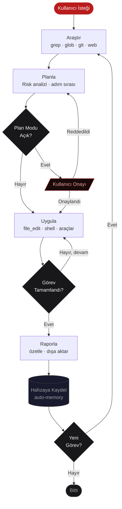

<p align="center">
  
</p>

<h1 align="center">SETH</h1>

<p align="center">
  <strong>Terminalde çalışan otonom yapay zeka kodlama ve siber güvenlik ajanı.</strong><br/>
  Türkçe arayüz · 12 AI sağlayıcı · 60+ araç · CTF motoru · Kalıcı bellek
</p>

<p align="center">
  
  
  
  
  
</p>

<p align="center">
  <a href="https://seth.mustafakemalcingil.site">Web Sitesi</a> ·
  <a href="#-kurulum">Kurulum</a> ·
  <a href="#-komutlar">Komutlar</a> ·
  <a href="#-desteklenen-ai-sağlayıcıları">Sağlayıcılar</a>
</p>

---

## SETH Nedir?

SETH, terminalde çalışan Türkçe arayüzlü bir yapay zeka ajanıdır. Kod yazar, test çalıştırır, güvenlik taraması yapar, CTF çözer ve raporlar. Siz yönlendirin, SETH uygulasın.

**Temel döngü:** `Araştır → Planla → Uygula → Raporla`



```
sen: "auth middleware'ini JWT'ye geçir ve testleri yaz"

SETH: src/ taranıyor... middleware.ts bulundu
      Değişiklik planı hazırlandı (3 dosya)
      [Onaylıyor musunuz? e/h]
      file_edit: middleware.ts ✓
      file_write: middleware.test.ts ✓
      shell: npm test → 12/12 geçti ✓
```

---

## Neden SETH?

| | SETH | ChatGPT | Copilot | Cursor |
|---|---|---|---|---|
| AI Sağlayıcı | **12** | 1 | 1 | 2 |
| Offline / Yerel | ✓ | ✗ | ✗ | kısmi |
| CTF & Pentest | ✓ | ✗ | ✗ | ✗ |
| Multi-Agent | ✓ | ✗ | ✗ | ✗ |
| Kalıcı Hafıza | ✓ | kısmi | ✗ | kısmi |
| Checkpoint | ✓ | ✗ | ✗ | ✗ |
| Açık Kaynak | ✓ | ✗ | ✗ | ✗ |

---

## Kurulum

```bash
npm install -g github:MustafaKemal0146/seth
```

```bash
seth                                    # Etkileşimli mod
seth --provider groq                    # Belirli sağlayıcı ile başlat
seth -p "bu projeyi özetle"            # Tek seferlik (headless) mod
seth --auto -p "testleri çalıştır"     # Onaysız otonom mod
```

### Hızlı Başlangıç

```bash
# 1. API anahtarınızı ayarlayın (ya da Ollama ile ücretsiz başlayın)
export ANTHROPIC_API_KEY=sk-ant-...

# 2. Projenize gidin
cd benim-projem/

# 3. Başlatın
seth

# Ortam sağlığını kontrol edin
/doktor
```

---

## Desteklenen AI Sağlayıcıları

| Sağlayıcı | Komut | Env Değişkeni | Not |
|-----------|-------|----------------|-----|
| **Ollama** | `--provider ollama` | — | Ücretsiz, yerel, offline |
| **LM Studio** | `--provider lmstudio` | — | GUI ile yerel model |
| **Groq** | `--provider groq` | `GROQ_API_KEY` | En hızlı çıkarım |
| **DeepSeek** | `--provider deepseek` | `DEEPSEEK_API_KEY` | Düşük maliyet |
| **Mistral** | `--provider mistral` | `MISTRAL_API_KEY` | Açık ağırlıklı |
| **xAI (Grok)** | `--provider xai` | `XAI_API_KEY` | Gerçek zamanlı web |
| **LiteLLM** | `--provider litellm` | `LITELLM_API_KEY` | 100+ provider proxy |
| **GitHub Copilot** | `--provider copilot` | — | Proxy üzerinden |
| **OpenRouter** | `--provider openrouter` | `OPENROUTER_API_KEY` | 300+ model |
| **Anthropic Claude** | `--provider claude` | `ANTHROPIC_API_KEY` | Kod odaklı |
| **OpenAI** | `--provider openai` | `OPENAI_API_KEY` | GPT-4o ve üstü |
| **Google Gemini** | `--provider gemini` | `GEMINI_API_KEY` | 2M token bağlam |

Çalışma sırasında geçiş: `/sağlayıcı groq`

---

## Komutlar

### Bilgi & Analiz

| Komut | Açıklama |
|-------|----------|
| `/yardım` | Tüm komutları ve kısayolları listele |
| `/istatistikler` | Token kullanımı, gerçek maliyet, araç istatistikleri |
| `/maliyet` | Oturum maliyet tablosu + saatlik tahmin |
| `/bağlam` | Token dağılımı ve doluluk çubuğu |
| `/doktor` | Ortam sağlığı, araç kontrolü, otomatik kurulum |
| `/provider-test` | Sağlayıcı bağlantı testi + gecikme karşılaştırması |
| `/repo_özet` | Git dalı, son commit, değişiklik istatistikleri |
| `/güncelle` | Yeni sürüm kontrolü |

### Bellek & Oturum

| Komut | Açıklama |
|-------|----------|
| `/hafıza` | Kalıcı belleği görüntüle (user/project/feedback) |
| `/hafıza ekle <tip> <içerik>` | Belleğe giriş ekle |
| `/hafıza sil <tip>` | Bellek tipini temizle |
| `/sıkıştır` | Geçmişi AI ile özetle (token tasarrufu) |
| `/checkpoint [ad]` | Konuşma anını kaydet |
| `/checkpoint listele` | Kayıtlı anları göster |
| `/checkpoint yükle <ad>` | Kaydedilmiş ana dön |
| `/paylaş` | Konuşmayı `~/.seth/exports/` klasörüne aktar |
| `/geçmiş` | Önceki oturumu devam ettir |
| `/context-temizle` | Oturumu sıfırla, temiz başla |

### Ayarlar

| Komut | Açıklama |
|-------|----------|
| `/değiştir` | Etkileşimli ayar menüsü |
| `/sağlayıcı <isim>` | AI sağlayıcısını değiştir |
| `/modeller` | Canlı model listesi + seçim |
| `/model <isim>` | Modeli doğrudan ayarla |
| `/tema` | Renk teması seç (dark/light/cyberpunk/retro/ocean/sunset) |
| `/context <miktar>` | Token bütçesini ayarla (örn: `500k`, `2m`) |
| `/yetki <full\|normal\|dar>` | İzin seviyesi |
| `/güvenlik <safe\|standard\|pentest>` | Güvenlik profili |
| `/effort [low\|medium\|high\|max]` | Yanıt derinliği — hız/kalite dengesi |
| `/paralel <1-20>` | Eş zamanlı araç sayısı (varsayılan: 5) |
| `/vim` | Vim modunu aç/kapat (INSERT/NORMAL) |
| `/keybindings` | Tuş kısayollarını göster / özelleştir |
| `/apikey` | API anahtarlarını yönet |

### Ajan & Skill

| Komut | Açıklama |
|-------|----------|
| `/ajan <açık\|kapalı>` | Otonom ajan modunu aç/kapat |
| `/plan-modu <açık\|kapalı>` | Plan onay modu — AI önce plan sunar, sen onaylarsın |
| `/koordinator <görev>` | Görevi alt ajanlara böl, paralel çalıştır |
| `/ajanlar` | Aktif alt ajan sayısını göster |
| `/skills` | Yüklü skill'leri listele |
| `/skill <isim> [parametreler]` | Skill çalıştır |

### Araçlar & Sistem

| Komut | Açıklama |
|-------|----------|
| `/incele [--staged\|--head\|<dosya>]` | Git diff'i AI ile code review yap |
| `/pr-incele <PR numarası veya URL>` | GitHub PR'ı AI ile incele |
| `/ide [dosya:satır]` | Dosyayı VS Code veya editörde aç |
| `/tarayıcı` | Otonom Puppeteer tarayıcısını başlat |
| `/rapor pdf` | Güvenlik taraması PDF raporu |
| `/cron ekle <isim> <süre> <prompt>` | Periyodik görev ekle (`1m/1h/1d`) |
| `/hook [liste\|örnek]` | Hook sistemi yönetimi |
| `/cd <dizin>` | Çalışma dizinini değiştir |

### CTF & Siber Güvenlik

| Komut | Açıklama |
|-------|----------|
| `/ctf --dosya <dosya>` | CTF analiz motorunu başlat |
| `/ctf --kategori <web\|crypto\|pwn\|forensics\|rev\|stego\|osint>` | Kategori belirt |
| `/güvenlik pentest` | Pentest profilini etkinleştir |

### Kısayollar

| Kısayol | Açıklama |
|---------|----------|
| `Ctrl+C` | İşlemi iptal et / modeli durdur |
| `Esc` | AI yanıtını anında durdur |
| `Ctrl+R` | Geçmişte fuzzy arama |
| `Ctrl+D` | Çıkış |
| `\` | Çok satırlı girdi modu |

---

## Yapılandırma

### Ortam Değişkenleri

```bash
export ANTHROPIC_API_KEY=sk-ant-xxxxx
export OPENAI_API_KEY=sk-xxxxx
export GEMINI_API_KEY=AIzaxxxxx
export GROQ_API_KEY=gsk_xxxxx
export DEEPSEEK_API_KEY=sk-xxxxx
export MISTRAL_API_KEY=xxxxx
export XAI_API_KEY=xai-xxxxx
export OPENROUTER_API_KEY=sk-or-xxxxx
# Ollama ve LM Studio için API anahtarı gerekmez
```

### `~/.seth/settings.json`

```json
{
  "defaultProvider": "ollama",
  "defaultModel": "qwen2.5-coder:7b",
  "providers": {
    "ollama":   { "baseUrl": "http://localhost:11434", "model": "qwen2.5-coder:7b" },
    "groq":     { "apiKey": "gsk_xxx", "model": "llama-3.3-70b-versatile" },
    "deepseek": { "apiKey": "sk-xxx",  "model": "deepseek-chat" },
    "claude":   { "apiKey": "sk-ant-xxx", "model": "claude-sonnet-4-20250514" }
  }
}
```

### Proje Talimatları (Otomatik Yükleme)

Çalışma dizininde aşağıdaki dosyalar varsa sistem istemine otomatik eklenir:

| Dosya | Açıklama |
|-------|----------|
| `SETH.md` | SETH'e özel proje talimatları |
| `CLAUDE.md` | Claude uyum katmanı |
| `AGENTS.md` | Ajan direktifleri |
| `.seth/instructions.md` | Gizli proje talimatları |

---

## Özellikler

### Kalıcı Bellek

SETH iki katmanlı bellek sistemi kullanır:

**Manuel Bellek** (`~/.seth/memory/`):
```bash
/hafıza ekle user    "Kıdemli TypeScript geliştiricisiyim"
/hafıza ekle project "Bu proje Next.js + Prisma + PostgreSQL kullanıyor"
/hafıza ekle feedback "Commit mesajları Conventional Commits formatında olsun"
```

**Otomatik Bellek** (`~/.seth/auto-memory/`):
Konuşma sonunda AI önemli bilgileri otomatik kaydeder. Bir sonraki oturumda proje tercihleri, teknik kararlar ve bulgular hazır olur.

### Skill Sistemi

`~/.seth/skills/` klasörüne Markdown dosyaları ekleyerek özel iş akışları oluştur:

```markdown
---
name: güvenlik-tarama
description: Projeyi güvenlik açıkları için tara
---

Aşağıdaki projeyi güvenlik açıkları için analiz et:
{{params}}

Kontrol listesi:
- SQL injection noktaları
- Kimlik doğrulama zafiyetleri
- Hassas veri ifşası
```

```bash
/skill güvenlik-tarama src/api/
```

Yerleşik skill'ler: `review` · `refactor` · `explain`

### Multi-Agent Koordinatör

Büyük görevleri paralel alt ajanlara böl:

```bash
/koordinator "projenin tüm API endpoint'lerini test et, güvenlik açıklarını bul ve rapor oluştur"
```

Koordinatör görevi 2-5 bağımsız alt göreve böler, hepsini eş zamanlı çalıştırır ve sonuçları birleştirir.

### Güvenlik Profilleri

```bash
/güvenlik safe       # Sadece okuma işlemleri
/güvenlik standard   # Varsayılan — kritik işlemler onay ister
/güvenlik pentest    # Tam araç seti: nmap, sqlmap, nuclei, ffuf...
```

İzin seviyeleri:
```bash
/yetki full    # Onaysız çalışır
/yetki normal  # Kritik işlemler onay ister (varsayılan)
/yetki dar     # Her işlem onay ister
```

### Vim Modu

```bash
/vim  # INSERT/NORMAL mod geçişi
```

NORMAL modda: `h/j/k/l` · `w/b/e` · `0/$` · `dd/dw` · `cc/cw` · `.` (dot-repeat)

### Hook Sistemi

`~/.seth/hooks.json`:

```json
[
  { "event": "PreToolUse",  "tool": "file_write", "command": "git add -A" },
  { "event": "PostToolUse", "tool": "shell",       "command": "notify-send 'Tamamlandı'", "async": true },
  { "event": "OnResponse",                         "command": "espeak 'hazır'", "async": true }
]
```

### Cron / Periyodik Görevler

```bash
/cron ekle günlük-özet  1d  "bugünkü değişiklikleri özetle ve commit öner"
/cron ekle saatlik-test 1h  "testleri çalıştır, hataları raporla"
/cron liste
/cron sil <id>
```

### Web Arayüzü

Seth'i tarayıcıdan da yönetebilirsin. WebSocket tabanlı gerçek zamanlı akış, araç görünürlüğü, plan onayı ve diff görselleştirme.

---

## Araçlar

### Dosya & Kod
`file_read` · `file_write` · `file_edit` · `batch_read` · `glob` · `list_directory` · `search`

### Git
`git_status` · `git_diff` · `git_log` · `git_worktree` · `repo_ozet`

### Web & Ağ
`web_fetch` · `web_search` · `browser_automation` (Puppeteer)

### Ajan & Bellek
`agent_spawn` · `ask_user` · `memory_read` · `memory_write` · `mcp_arac` · `lsp_diagnostics`

### Siber Güvenlik
`nmap` · `sqlmap` · `nikto` · `gobuster` · `ffuf` · `nuclei` · `masscan` · `subfinder` · `wpscan` · `whois` · `dig` · `whatweb` · `shodan` · `john` · `hashcat`

### CTF
`ctf_auto` · `ctf_solver` · `ctf_web_analyzer` · `ctf_network_analyzer` · `ctf_stego` · `ctf_file_analyzer`

---

## Model Benchmark

`/maliyet` ve `/provider-test` komutlarıyla gerçek zamanlı ölçüm yapabilirsin.

| Provider | Model | Hız (tok/s) | Input | Output | Özellik |
|----------|-------|:-----------:|-------|--------|---------|
| **Groq** | llama-3.3-70b | **~900** | $0.059/M | $0.079/M | En hızlı çıkarım |
| **Gemini** | gemini-2.0-flash | ~250 | $0.10/M | $0.40/M | 2M token bağlam |
| **DeepSeek** | deepseek-chat | ~120 | $0.14/M | $0.28/M | Düşük maliyet |
| **Mistral** | mistral-large | ~90 | $2/M | $6/M | Avrupa gizliliği |
| **Claude** | sonnet-4 | ~80 | $3/M | $15/M | Kod odaklı |
| **OpenAI** | gpt-4o | ~80 | $5/M | $15/M | Genel amaç |
| **xAI** | grok-3 | ~70 | $3/M | $15/M | Gerçek zamanlı web |
| **Ollama / LM Studio** | (donanıma göre) | ~20–150 | **Ücretsiz** | **Ücretsiz** | Tam gizlilik |

> Hız değerleri tipik koşullar altında ölçülmüştür, ağ gecikmesi ve yük durumuna göre değişebilir.

---

## Kullanım Senaryoları

### CTF Çözümü

```bash
seth --provider groq          # Hızlı model seç

/güvenlik pentest             # Pentest profilini aç
/ctf --dosya challenge.jpg    # Dosyayı analiz et — kategori otomatik tespit edilir

# SETH şunları yapar:
#  magic bytes analizi → steganografi tespiti → LSB çıkarma → flag arama
#  Sonuç: FLAG{g1zl1_veri_bulundu}
```

---

### Güvenlik Taraması

```bash
seth

/güvenlik pentest
/koordinator "hedef.com alan adını tüm açılardan tara: subdomain, port, web zafiyeti, SSL"

# SETH paralel çalışır:
#  [Ajan 1] subfinder → 47 subdomain bulundu
#  [Ajan 2] nmap → 3 açık port, 1 eski servis
#  [Ajan 3] nuclei → 2 orta, 1 kritik zafiyet
#  Koordinatör sonuçları birleştirir

/rapor pdf                    # Profesyonel PDF raporu oluştur
```

---

### Kod Review & Refactor

```bash
seth

/incele --staged              # Staged değişiklikleri AI ile incele

# ya da belirli bir dosya:
/skill review src/auth/middleware.ts

# PR incelemesi:
/pr-incele 142                # GitHub PR #142'yi çek ve analiz et
```

---

### Büyük Proje Analizi

```bash
seth --provider gemini        # 2M token bağlamla devasa repo analizi

sen: "bu projenin mimarisini anla, teknik borçları listele ve öncelikli iyileştirme önerisi sun"

# SETH sırayla yapar:
#  glob ile tüm dosya yapısını tarar
#  import/export grafiğini çıkarır
#  git log ile değişim sıklığını analiz eder
#  Yapılandırılmış rapor sunar
```

---

### Otomatik Test Yazımı

```bash
# Tek seferlik headless mod:
seth --auto -p "src/utils/ klasöründeki tüm fonksiyonlar için vitest unit testleri yaz, çalıştır ve hataları düzelt"

# SETH durdurmadan çalışır:
#  Fonksiyonları okur → test dosyaları yazar → vitest çalıştırır → hataları düzeltir → tekrar çalıştırır
```

---

### Günlük Geliştirme Akışı

```bash
# Sabah: dünü özetle
/repo_özet

# Yeni özellik:
sen: "kullanıcı profil sayfası ekle, mevcut auth sistemini kullan"

# Değişiklikleri incele:
/incele --staged

# Oturumu kaydet:
/checkpoint oturum-2025-04-23

# Akşam: maliyet kontrolü:
/maliyet
```

---

## Mimari

```
src/
├── cli.ts                  # CLI giriş noktası
├── repl.ts                 # Etkileşimli terminal (vim modu, keybindings, context bar)
├── headless.ts             # Headless mod (-p flag)
├── commands.ts             # 90+ slash komutu
├── vim-mode.ts             # INSERT/NORMAL vim state machine
├── keybindings.ts          # ~/.seth/keybindings.json yapılandırması
├── skills.ts               # Skill sistemi (built-in + kullanıcı)
├── rolling-summary.ts      # Otomatik bağlam sıkıştırma
├── permission-classifier.ts# Araç izin sınıflandırıcı
├── agent/
│   ├── loop.ts             # Ajan döngüsü (streaming, araç yürütme, fallback)
│   └── coordinator.ts      # Multi-agent koordinatör
├── providers/              # Claude, Gemini, OpenAI, Ollama, Groq, DeepSeek,
│                           # Mistral, xAI, LM Studio, LiteLLM, OpenRouter, Copilot
├── tools/                  # 60+ yerleşik araç
├── web/                    # WebSocket tabanlı tarayıcı arayüzü
├── auto-memory.ts          # Otomatik bellek çıkarma ve sıkıştırma
├── cron.ts                 # Periyodik görev sistemi
├── model-cost.ts           # Gerçek model fiyat tablosu
└── storage/                # Oturum, geçmiş, bellek, araç metrikleri
```

---

## Gereksinimler

- **Node.js** ≥ 20
- En az bir AI sağlayıcısı (Ollama ücretsiz ve yerel)
- **İsteğe bağlı:** `ripgrep` — hızlı arama
- **İsteğe bağlı:** `nmap`, `sqlmap`, `nikto`, `nuclei` — güvenlik araçları
- **İsteğe bağlı:** `pdflatex` — PDF rapor üretimi
- **İsteğe bağlı:** `xclip` / `wl-paste` — pano desteği (Linux)

---

## Lisans

**GNU Affero General Public License v3.0 (AGPL-3.0)**

- Kişisel ve eğitim amaçlı kullanım serbesttir
- Kaynak kodu inceleyebilir ve değiştirebilirsin
- Değiştirip dağıtırsan kaynak kodunu açık kaynak yapmak zorundasın
- Ağ üzerinden servis olarak sunarsan kaynak kodunu paylaşmak zorundasın
- Ticari kullanım veya özel lisans için iletişime geç
